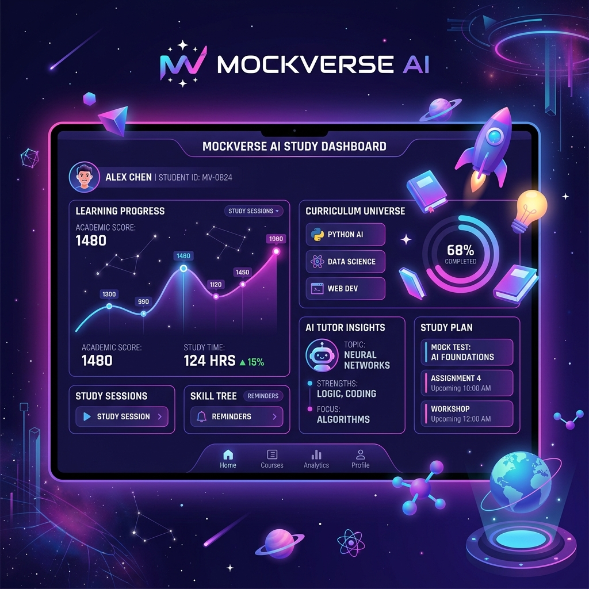
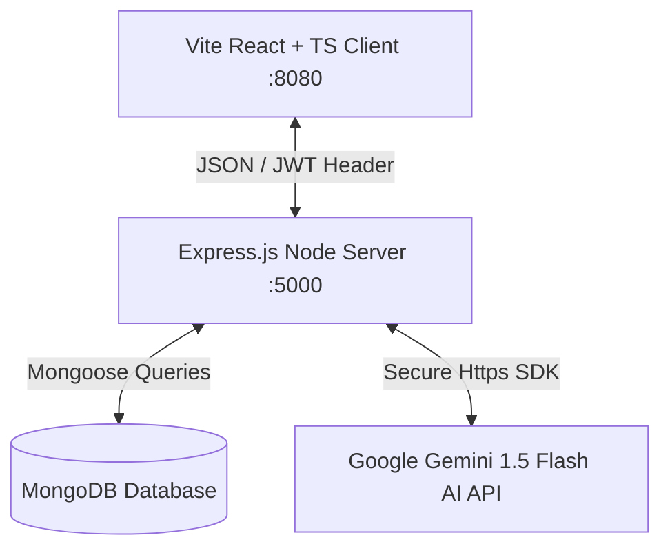

# MockVerse(AI) — Paper Pal Smart Grade 🌟

[](#)
[](#)
[](#)
[](docs/PROJECT_DEEP_DIVE.md)
[](#)

> 💡 **Study Guide Available**: Read [docs/PROJECT_DEEP_DIVE.md](docs/PROJECT_DEEP_DIVE.md) for a complete 15-phase codebase breakdown and 30 mock interview questions covering system design, debugging, security, databases, React, and Node.js.

**MockVerse(AI)** is a state-of-the-art, production-grade educational AI workspace that empowers students and educators to **generate high-fidelity question papers**, **solve exam sets in a dual-column workspace**, **explore worked solutions**, **evaluate answers with instant AI scorecards**, and **discuss concepts in real-time** with a context-grounded AI tutor.

This project is built using a modern **MongoDB, Express, React, and Node.js (MERN) Stack** with **TypeScript** type-safety, **Mongoose** database schemas, **JWT security**, and secure backend API proxying for **Google Gemini AI**.

---

## 📸 Product Preview

<div align="center">
  
  <p><em>Immersive full-stack AI-powered educational ecosystem.</em></p>
</div>

---

## 🚀 Key Features & Architectural Enhancements

*   **🪄 Smart AI Exam Builder**: Re-engineered the question paper generator into a progressive 5-step guided wizard (*Target* $\rightarrow$ *Subject* $\rightarrow$ *Chapters* $\rightarrow$ *Settings* $\rightarrow$ *AI Tags*) featuring 1-click Preset Cards (School, Competitive, College, Custom), Searchable Subject Autocomplete, Bulk Chapter Import, Interactive AI Instruction Tags (*HOTS*, *Conceptual Focus*, *Strict NCERT*, *Tricky Numericals*, *Olympiad Level*), and a Sticky Live Exam Summary sidebar with real-time AI readiness scoring.
*   **⚡ Two-Column Interactive Workspace**: Re-architected the exam workspace into a responsive side-by-side layout. Students read the scrollable question paper on the left while drafting answers in real-time on the right, eliminating vertical scroll fatigue.
*   **🧩 Heuristic Question Parser**: Dynamically parses raw AI Markdown question papers using regular expressions, generating discrete answer fields pre-loaded with the exact question text.
*   **🚀 Production-Grade PDF Pagination Exporter**: Optimized A4 PDF compilation with a pagination slicing algorithm that handles tall elements without page overflows. Fixed mobile viewport clipping issues via fixed positioning (`left: -9999px`), synchronized image loading pre-captures, CORS support, and cross-platform serif font fallbacks (`Times New Roman, Times, Georgia, serif`).
*   **🛡️ Fail-Safe Rendering Boundaries**: Wrapped async PDF compilations inside a 12-second `Promise.race` timeout and integrated 1-second MathJax typeset compilation races. If drawing ever hangs, the system automatically rejects, displays warning toasts, unmounts layout variables, and restores browser responsiveness.
*   **⚡ 99% Entry Bundle Code-Splitting**: Code-split large dependencies (`jspdf`, `html2canvas`, `react-markdown`, `lucide-react`) and lazy-loaded feature modules (`frontend/src/features/papers/`, `frontend/src/features/resources/`, `frontend/src/features/auth/`).
*   **🔒 Hardened Security Auditing**: Implemented string-casting checks on request body parameters to immunize all Mongoose queries against MongoDB injection attacks. Protected shared syllabus imports and dynamic HTML file exports from XSS injections using `DOMPurify` filters.
*   **💬 Context-Aware AI Chatbot with Memory**: A companion study bot that remembers the context of the active question paper and maintains multi-turn conversation history (last 10 messages) using structured backend prompts and ReactMarkdown responses.
*   **🛡️ Resilience Retry Loops**: Configured 3x retry loops with exponential backoff on the backend to automatically recover from transient Gemini API rate limit (429) or 5xx server errors. Enforced JWT secret presence checks in production startup.
*   **🏷️ Dynamic PDF Header Stamping**: Dynamically renders Class, Board, Marks, and Difficulty parameters in the print PDF layout header.
*   **🛑 Strict Form Field Validation**: Form fields inside the Smart AI Exam Builder feature visual highlights, red outline alerts, and validation toasts to prevent silent submit errors.
*   **🔐 Advanced JWT Authentication**: Secure user registration (signup) and login with encrypted passwords (`bcryptjs`). Session states are isolated per-user.
*   **📚 Modular CRUD Resources Library**: Re-architected resource collections (`ResourceList`, `ResourceForm`, `CollectionHeader`, `SheetSelector`). Add study notes, textbooks, and tutorial resources with full single-responsibility isolation.
*   **🔗 Base64 Quick Sharing**: Click to copy an encrypted Base64 URL for any library item, allowing quick sharing. Visiting users receive an interactive import overlay popup.
*   **📄 Clickable HTML & PDF Export**: Click the download action to compile your resource into a beautiful standalone single-file HTML or PDF sheet containing active clickable links.
*   **📜 Persistent Exam History**: All question papers, solution sheets, and grading records are stored in a MongoDB database so users can view their academic journey at any time.

---

## 🏗️ Folder Structure & Architecture

```text
MockVerse(Ai)
├── backend/                  # Express API Server & Database configs
│   ├── src/
│   │   ├── config/           # Database connectivity (Mongoose)
│   │   ├── controllers/      # Auth & AI Paper/Resource controllers
│   │   ├── middleware/       # JWT auth, rate limiting, & route guards
│   │   ├── models/           # Mongoose schemas (User, QuestionPaper)
│   │   └── server.js         # Express listener & static file server
│   ├── .env.example          # Sample environment templates
│   ├── .gitignore            # Backend ignore filters
│   └── package.json          # Node dependencies & run scripts
│
├── frontend/                 # Vite + React + TS Client Application
│   ├── public/               # Static assets & illustrations
│   │   └── images/           # Premium Vector Workspace Hero illustrations
│   ├── src/
│   │   ├── components/       # Shadcn UI widgets, chatbot, & menus
│   │   │   ├── tabs/         # Answer, Evaluate, and Resource dashboard tabs
│   │   │   └── ui/           # Radix UI wrapper primitives
│   │   ├── contexts/         # React Theme & Auth global state handlers
│   │   ├── hooks/            # Toast notifications & PDF generators
│   │   ├── pages/            # Auth login & Main dashboard page layouts
│   │   └── services/         # apiService.ts client fetching layer
│   ├── index.html            # Core entry layout HTML
│   ├── vite.config.ts        # Vite config with code-splitting
│   ├── tailwind.config.ts    # Custom dashboard color tokens (indigo/pink/slate)
│   └── package.json          # Client dependencies & scripts
│
├── docs/                     # Design Case Studies & API references
│   ├── ARCHITECTURE.md       # System architecture & design specification
│   ├── CASE_STUDY.md         # Professional 25-section software engineering breakdown
│   ├── API_FLOW.md           # API lifecycle charts
│   └── PROJECT_DEEP_DIVE.md  # 15-Phase Technical Interview & Codebase Breakdown
├── .gitignore                # Global version control ignores
└── README.md                 # Complete full-stack guide & manuals (This File)
```

### 🤝 Data Sync Diagram


---

## 📦 API Endpoints Reference

| Category | Endpoint | Method | Access | Description |
| :--- | :--- | :---: | :---: | :--- |
| **Auth** | `/api/auth/signup` | `POST` | Public | Register a new user account. Returns metadata and JWT. |
| **Auth** | `/api/auth/login` | `POST` | Public | Login with credentials. Returns metadata and JWT. |
| **Auth** | `/api/auth/profile` | `GET` | Private | Get details of the logged-in user profile. |
| **Auth** | `/api/auth/api-key` | `PUT` | Private | Save a user's Gemini API key (encrypted with AES-256-CBC). |
| **Auth** | `/api/auth/api-key` | `GET` | Private | Retrieve the user's masked API key. |
| **Auth** | `/api/auth/api-key` | `DELETE` | Private | Remove the user's stored API key. |
| **Papers** | `/api/papers` | `POST` | Private | Generate and save a new custom AI question paper. |
| **Papers** | `/api/papers` | `GET` | Private | Fetch the authenticated user's complete paper history. |
| **Papers** | `/api/papers/:id` | `GET` | Private | Fetch a detailed question paper by ID. |
| **Papers** | `/api/papers/:id` | `DELETE` | Private | Delete a question paper by ID. |
| **Papers** | `/api/papers/:id/solutions` | `POST` | Private | Generate step-by-step worked solutions for a paper. |
| **Papers** | `/api/papers/:id/evaluate` | `POST` | Private | Evaluate student answers and get itemized scorecards. |
| **Chat** | `/api/chat` | `POST` | Private | Message the chatbot within the active paper context. |
| **Health** | `/api/health` | `GET` | Public | Server health check with DB status, uptime, and environment. |

---

## ⚙️ Environment Configuration

Create a `.env` file inside the `/backend` folder with the following variables:

```env
PORT=5000
NODE_ENV=production
MONGODB_URI="mongodb+srv://<user>:<pass>@cluster.mongodb.net/mockverse"
JWT_SECRET="your_secure_jwt_random_string_key"
GEMINI_API_KEY="your_google_gemini_api_key"
FRONTEND_URL="https://your-frontend-domain.vercel.app"
```

For the frontend, create a `.env` file in the `/frontend` folder:

```env
VITE_API_URL="https://your-backend-domain.onrender.com/api"
```

---

## ⚡ Quickstart Guide

### 1. Prerequisites
Ensure you have **Node.js** (v18+) and **MongoDB** server active on your system.

### 2. Backend Installation
```bash
cd backend
npm install
```

### 3. Frontend Installation
```bash
cd frontend
npm install
```

### 4. Running the Servers Locally

#### Launch the Express Backend (Port 5000):
```bash
cd backend
npm run dev
```

#### Launch the Vite Frontend (Port 8080):
```bash
cd frontend
npm run dev
```
Open `http://localhost:8080` in your web browser.

---

## 🐳 Deployment Readiness & Production Build

### Vercel (Frontend)
1. Connect the `frontend/` directory as the root in Vercel.
2. Set the build command to `npm run build` and the output directory to `dist`.
3. Add the environment variable `VITE_API_URL` pointing to your Render backend URL.

### Render (Backend)
1. Connect the `backend/` directory as the root.
2. Set the build command to `npm install` and the start command to `node src/server.js`.
3. Add the following environment variables: `MONGODB_URI`, `JWT_SECRET`, `GEMINI_API_KEY`, `FRONTEND_URL`, `NODE_ENV=production`.

### MongoDB Atlas
1. Create a cluster and add your Render backend IP to the Network Access list.
2. Copy the connection string and paste it as the `MONGODB_URI` value.

### Local Production Build
1.  **Build the Frontend Assets**:
    ```bash
    cd frontend
    npm run build
    ```
    This compiles Vite React static files into `/frontend/dist`.

2.  **Run in Production Mode**:
    Set `NODE_ENV=production` in your hosting service environment variables and start the server:
    ```bash
    cd backend
    npm start
    ```
    The backend server will automatically serve the static frontend bundle.
