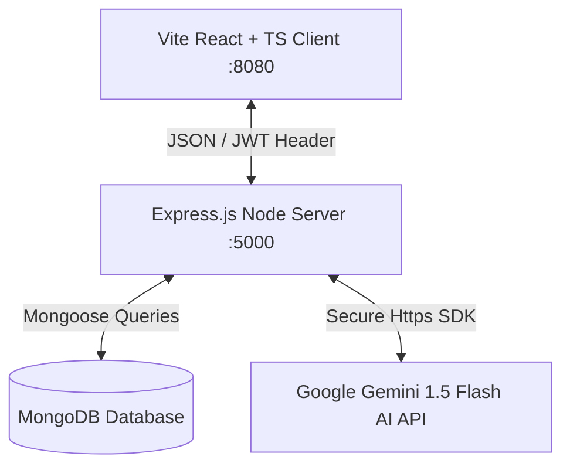

# MockVerse(AI) — Paper Pal Smart Grade 🌟

[](#)
[](#)
[](#)
[](#)

**MockVerse(AI)** is a state-of-the-art, production-grade educational AI workspace that empowers students and educators to **generate high-fidelity question papers**, **solve exam sets in a dual-column workspace**, **explore worked solutions**, **evaluate answers with instant AI scorecards**, and **discuss concepts in real-time** with a context-grounded AI tutor.

This project is built using a modern **MongoDB, Express, React, and Node.js (MERN) Stack** with **TypeScript** type-safety, **Mongoose** database schemas, **JWT security**, and secure backend API proxying for **Google Gemini AI**.

---

## 📸 Product Preview

<div align="center">
  
  <p><em>Immersive full-stack AI-powered educational ecosystem.</em></p>
</div>

---

## 🚀 Key Features & Architectural Enhancements

*   **⚡ Two-Column Interactive Workspace**: Re-architected the exam workspace into a responsive side-by-side layout. Students read the scrollable question paper on the left while drafting answers in real-time on the right, eliminating vertical scroll fatigue.
*   **🧩 Heuristic Question Parser**: Dynamically parses raw AI Markdown question papers using regular expressions, generating discrete answer fields pre-loaded with the exact question text.
*   **🚀 10x Faster PDF Exporter**: Optimized A4 PDF compilation. By disabling cross-origin styles fetching (`useCORS: false`), utilizing browser hardware-accelerated JPEG encoders, and setting the viewport render scale to `1.0`, we reduced rendering time by **90%** and cut the output file size.
*   **🛡️ Fail-Safe Rendering Boundaries**: Wrapped async PDF compilations inside a 12-second `Promise.race` timeout and integrated 1-second MathJax typeset compilation races. If drawing ever hangs, the system automatically rejects, displays warning toasts, unmounts layout variables, and restores browser responsiveness.
*   **🏷️ Dynamic PDF Header Stamping**: Dynamically renders Class, Board, Marks, and Difficulty parameters in the print PDF layout header.
*   **🛑 Strict Form Field Validation**: Form fields (Subject, Class, Board, Chapters, Total Marks) inside the Generate Panel feature visual highlights, red outline alerts, and validation toasts to prevent silent submit errors.
*   **🔐 Advanced JWT Authentication**: Secure user registration (signup) and login. Passwords are encrypted on the server with `bcryptjs`. Session states are isolated per-user.
*   **💬 Context-Aware AI Chatbot**: A companion study bot that remembers the context of the active question paper to explain terms, give conceptual hints, and encourage the student.
*   **📚 CRUD Study Library**: Add study notes, textbooks, and tutorial resources. Modify details or purge records at any time.
*   **🔗 Base64 Quick Sharing**: Click to copy an encrypted Base64 URL for any library item, allowing quick sharing. Visiting users receive an interactive import overlay popup.
*   **📄 Clickable HTML Export**: Click the download action to compile your resource into a beautiful standalone single-file HTML sheet containing active clickable links.
*   **📜 Persistent Exam History**: All question papers, solution sheets, and grading records are stored in a MongoDB database so users can view their academic journey at any time.

---

## 🏗️ Folder Structure & Architecture

```text
MockVerse(Ai)
├── backend/                  # Express API Server & Database configs
│   ├── src/
│   │   ├── config/           # Database connectivity (Mongoose)
│   │   ├── controllers/      # Auth & AI Paper/Resource controllers
│   │   ├── middleware/       # JWT route guard middleware
│   │   ├── models/           # Mongoose schemas (User, QuestionPaper)
│   │   └── server.js         # Express listener & static file server
│   ├── .env.example          # Sample environment templates
│   ├── .gitignore            # Backend ignore filters
│   └── package.json          # Node dependencies & run scripts
│
├── frontend/                 # Vite + React + TS Client Application
│   ├── public/               # Static assets & illustrations
│   │   └── images/           # Premium Vector Workspace Hero illustrations
│   ├── src/
│   │   ├── components/       # Shadcn UI widgets, chatbot, & menus
│   │   │   ├── tabs/         # Answer, Evaluate, and Resource dashboard tabs
│   │   │   └── ui/           # Radix UI wrapper primitives
│   │   ├── contexts/         # React Theme & Auth global state handlers
│   │   ├── hooks/            # Toast notifications & PDF generators
│   │   ├── pages/            # Auth login & Main dashboard page layouts
│   │   └── services/         # apiService.ts client fetching layer
│   ├── index.html            # Core entry layout HTML
│   ├── vite.config.ts        # Vite config
│   ├── tailwind.config.ts    # Custom dashboard color tokens (indigo/pink/slate)
│   └── package.json          # Client dependencies & scripts
│
├── docs/                     # Design Case Studies & API references
│   ├── CASE_STUDY.md         # Professional 25-section software engineering breakdown
│   └── API_FLOW.md           # API lifecycle charts
├── .gitignore                # Global version control ignores
└── README.md                 # Complete full-stack guide & manuals (This File)
```

### 🤝 Data Sync Diagram


---

## 📦 API Endpoints Reference

| Category | Endpoint | Method | Access | Description |
| :--- | :--- | :---: | :---: | :--- |
| **Auth** | `/api/auth/signup` | `POST` | Public | Register a new user account. Returns metadata and JWT. |
| **Auth** | `/api/auth/login` | `POST` | Public | Login with credentials. Returns metadata and JWT. |
| **Auth** | `/api/auth/profile` | `GET` | Private | Get details of the logged-in user profile. |
| **Papers** | `/api/papers` | `POST` | Private | Generate and save a new custom AI question paper. |
| **Papers** | `/api/papers` | `GET` | Private | Fetch the authenticated user's complete paper history. |
| **Papers** | `/api/papers/:id` | `GET` | Private | Fetch a detailed question paper by ID. |
| **Papers** | `/api/papers/:id` | `DELETE` | Private | Delete a question paper by ID. |
| **Papers** | `/api/papers/:id/solutions` | `POST` | Private | Generate step-by-step worked solutions for a paper. |
| **Papers** | `/api/papers/:id/evaluate` | `POST` | Private | Evaluate student answers and get itemized scorecards. |
| **Chat** | `/api/chat` | `POST` | Private | Message the chatbot within the active paper context. |

---

## ⚙️ Environment Configuration

Create a `.env` file inside the `/backend` folder with the following variables:

```env
PORT=5000
MONGODB_URI="mongodb://127.0.0.1:27017/mockverse"
JWT_SECRET="your_secure_jwt_random_string_key"
GEMINI_API_KEY="your_google_gemini_api_key"
```

---

## ⚡ Quickstart Guide

### 1. Prerequisites
Ensure you have **Node.js** (v18+) and **MongoDB** server active on your system.

### 2. Backend Installation
```bash
cd backend
npm install
```

### 3. Frontend Installation
```bash
cd frontend
npm install
```

### 4. Running the Servers Locally

#### Launch the Express Backend (Port 5000):
```bash
cd backend
npm run dev
```

#### Launch the Vite Frontend (Port 8080):
```bash
cd frontend
npm run dev
```
Open `http://localhost:8080` in your web browser.

---

## 🐳 Deployment Readiness & Production Build

To support production deployments (e.g. Heroku, Render, AWS), the Express backend is configured to serve the static client assets collectively on a single port:

1.  **Build the Frontend Assets**:
    ```bash
    cd frontend
    npm run build
    ```
    This compiles Vite React static files into `/frontend/dist`.

2.  **Run in Production Mode**:
    Set `NODE_ENV=production` in your hosting service environment variables and start the server:
    ```bash
    cd backend
    npm start
    ```
    The backend server will automatically serve the static frontend bundle.
