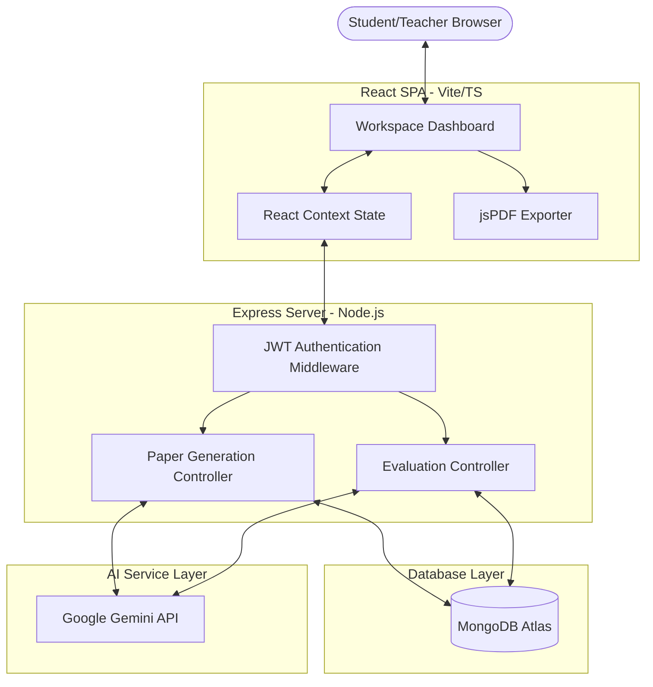
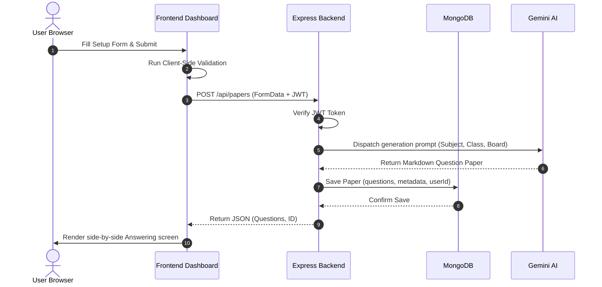
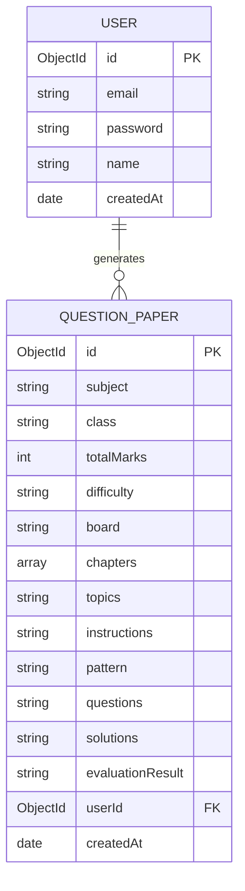

# MockVerse(AI) — Full-Stack Software Engineering Case Study 🌟

A comprehensive, production-grade project case study and systems architecture review designed for software engineers, hiring managers, technical interviewers, and open-source contributors.

---

## 1. Project Overview

*   **Project Name:** MockVerse(AI)
*   **One-Line Summary:** An AI-powered smart exam generator, interactive answering workspace, and automated evaluation system designed to streamline test preparation and feedback loops.
*   **Project Category:** EdTech / Artificial Intelligence / Productivity Tools
*   **Current Status:** Production Ready (Feature Complete & Stable)
*   **Demo Link:** `http://localhost:5173` (Local Development Setup)
*   **Repository Link:** `https://github.com/anuragsinghrajput123456789/paper-pal-smart-grade`

---

## 2. Executive Summary

### What the Project Does
MockVerse(AI) is a full-stack educational web application that automates the generation, examination, and grading workflows of academic testing. Leveraging generative AI, it compiles curriculum-specific, balanced mock exam sheets, offers an interactive time-bounded testing environment, grades written submissions on a question-by-question basis, and hosts a context-grounded educational chat tutor.

### Why It Was Built
Traditional mock examination prep is crippled by manual latency. Students must search for past papers, manually grade their responses, and seek educators to obtain explanation reviews. Educators spend significant administrative hours compiling test sheets and grading papers instead of addressing conceptual gaps. MockVerse(AI) was built to bridge this loop by providing a secure, automated, and high-fidelity testing workspace.

### Who It Helps
1.  **Students & Aspirants:** Gain immediate feedback on mock answers and receive personalized tutoring on weak topics.
2.  **Educators & Tutors:** Generate exam templates conforming to specific curriculum standards (CBSE, NCERT, ICSE) in seconds.
3.  **Self-Learners:** Prepare for certifications or placement papers under simulated exam conditions.

### Core Value Proposition
-   **Eliminate Delay:** Shrink the grading turnaround time from days to milliseconds.
-   **Contextual Tutoring:** Ensure the chatbot is grounded directly in the active test sheet and student solutions.
-   **No Code-Leaking Credentials:** Protect Gemini API credentials within backend environment enclosures.

---

## 3. Problem Statement

### Real-World Problem
Academic testing relies on a feedback loop: **Study $\rightarrow$ Test $\rightarrow$ Grade $\rightarrow$ Analyze $\rightarrow$ Correct**. However, the **Grade $\rightarrow$ Analyze** phases are subject to bottlenecks:
*   **Lack of Personalization:** Mass market practice papers do not target a student's specific weak chapters.
*   **Administrative Lag:** Teachers cannot grade 40 essay sheets instantly, resulting in a feedback lag of 3–7 days.
*   **Shallow Explanations:** Answer keys only list final answers, missing itemized, step-by-step derivations and reasoning.

### Existing Limitations
*   *Generic Generators:* Simple prompt interfaces (like ChatGPT) output unformatted blocks, often with placeholder texts, missing standard markers or structures.
*   *Security Risks:* Amateur educational tools often make direct API calls to OpenAI or Gemini from the frontend, exposing expensive private keys to client browsers.
*   *Scroll Fatigue UX:* Split online test frameworks stack the question sheet and answering boxes vertically, causing extreme UX scroll fatigue.

---

## 4. User Personas

```
+----------------------------------------------------------------------------------------------------------+
| 1. COLLEGE ASPIRANT (RAHUL, 21)                                                                          |
| - Goals: Wants to practice advanced Engineering Physics question papers tailored to electromagnetism.    |
| - Pain Points: Standard textbooks lack sufficient numerical mock papers with comprehensive solutions.    |
| - Workflow: Generates paper -> Starts 3-hour timer -> Fills answers -> Obtains AI grades.                |
+----------------------------------------------------------------------------------------------------------+
| 2. K-12 BOARD TEACHER (MRS. PATEL, 42)                                                                  |
| - Goals: Needs to compile 5 distinct Class 10 math exam sheets following CBSE guidelines.                |
| - Pain Points: Composing balanced templates with Section A (MCQs) and Section B (SAQs) takes hours.      |
| - Workflow: Sets parameters -> Assembles questions -> Downloads styled PDFs for classroom prints.        |
+----------------------------------------------------------------------------------------------------------+
```

---

## 5. Product Vision

### Long-Term Vision
MockVerse(AI) aims to develop into an **Adaptive AI Classroom** that automatically adjusts difficulty levels, monitors student progression, builds personalized review modules, and integrates OCR handwriting recognition.

### Future Roadmap
1.  **OCR Handwriting Analysis:** Let students upload smartphone photos of hand-written paper sheets, parsing text using vision models.
2.  **Adaptive Exam Sheets:** Analyze historical score reports to generate mock papers targeting identified weak chapters.
3.  **Collaborative Classroom Folders:** Permit teachers to publish generated mock sheets to public student groups with live leaderboards.

---

## 6. Feature Breakdown

### A. Question Paper Generator
*   **Purpose:** Assembles complete, balanced, and syllabus-conforming exam papers.
*   **User Benefit:** Creates target mock tests matching board formats (CBSE, ICSE) and difficulty criteria.
*   **Technical Implementation:** The client form validates inputs (Subject, Class, Board, Chapters) and posts to `/api/papers`. The Express backend formats an instructional system prompt, queries the Gemini API, saves the returned BSON document to MongoDB, and registers the paper in user history.
*   **Future Improvements:** Integrate curriculum blueprint schemas to auto-distribute marks across sections.

### B. Two-Column Interactive Workspace
*   **Purpose:** Simulates test hall conditions while keeping inputs side-by-side.
*   **User Benefit:** Eliminates scrolling by keeping questions visible on the left while typing answers on the right.
*   **Technical Implementation:** Styled with CSS flex grids and sticky bounds. Houses a Pomodoro clock and dynamically compiles text areas mapped to parsed markdown questions.
*   **Future Improvements:** Lock screen mode to prevent tab switching during live mocks.

### C. AI Answer Evaluation Engine
*   **Purpose:** Evaluates student solutions, providing scores and critique.
*   **User Benefit:** Pinpoints exact conceptual errors and grades exams instantly.
*   **Technical Implementation:** Feeds the original questions and student's answer array to Gemini. The model grades the responses against grading guidelines and updates the document status with the detailed score report.
*   **Future Improvements:** Generate visual progress charts mapping performance per chapter.

### D. Professional PDF Exporter
*   **Purpose:** Renders exam sheets to print-ready PDF files.
*   **User Benefit:** One-click downloads of beautifully typeset papers.
*   **Technical Implementation:** Renders an offscreen HTML container styled with a Times New Roman typographic system. Invokes MathJax to compile equations, records the container via `html2canvas`, and slices the image data into A4 pages in `jsPDF`.
*   **Future Improvements:** Vector-based PDF generation to allow direct text copying from the exported PDF.

---

## 7. Technology Stack Analysis

*   **Frontend:** React (Vite) + TypeScript
    *   *Why Selected:* Fast SPA performance and compile-time type-safety. Catching schema mismatches (e.g., `QuestionPaper` schema changes) at compile-time prevents runtime application failures.
    *   *Alternatives:* Vanilla JS / Angular. React was selected for its lighter virtual DOM footprint and rich ecosystem of UI components.
*   **Backend:** Node.js + Express
    *   *Why Selected:* Non-blocking asynchronous I/O allows Express to handle concurrent, long-running AI API proxy requests without blocking incoming database queries.
    *   *Alternatives:* Python (Django). Python is slower for proxy concurrency and introduces microservice hosting overhead.
*   **Database:** MongoDB + Mongoose
    *   *Why Selected:* AI outputs like comprehensive question papers contain highly structured but variable markdown text blocks. Document-based schemas match this data format natively. Storing chapter arrays natively as `[String]` avoids serialization overhead.
    *   *Alternatives:* MySQL / PostgreSQL. Relational DBs require complex join tables for chapters or expensive string conversion overhead.
*   **AI Engine:** Google Gemini AI (Gemini 1.5 Flash)
    *   *Why Selected:* Ultra-fast response times, 8K output limits, and developer-friendly pricing.

---

## 8. System Architecture

### High-Level Architecture
MockVerse(AI) is designed as a decoupled client-server architecture. The frontend React application manages user interactions, state hydration, and document rendering. The Node.js API acts as a secure controller proxy, managing database operations, user authentication (JWT), and external API integration.

### Mermaid System Architecture


### User Flow Diagram


---

## 9. Database Design

MockVerse(AI) implements MongoDB schemas structured to persist exam metadata, content records, and relationships.

### Entity Relationship Diagram


---

## 10. API Design

### Endpoints Structure

| Method | Endpoint | Description | Auth |
| :--- | :--- | :--- | :--- |
| **POST** | `/api/auth/signup` | Registers a new user account. | None |
| **POST** | `/api/auth/login` | Authenticates user credentials, yielding a JWT. | None |
| **GET** | `/api/auth/profile` | Fetches session context of the active profile. | Bearer JWT |
| **POST** | `/api/papers` | Formulates a new question paper using Gemini AI. | Bearer JWT |
| **GET** | `/api/papers` | Retrieves history of papers generated by the user. | Bearer JWT |
| **GET** | `/api/papers/:id` | Fetches details of a specific paper. | Bearer JWT |
| **DELETE** | `/api/papers/:id` | Permanently deletes a paper from the history. | Bearer JWT |
| **POST** | `/api/papers/:id/solutions`| Computes step-by-step solutions for a paper. | Bearer JWT |
| **POST** | `/api/papers/:id/evaluate` | Evaluates submitted student answers. | Bearer JWT |
| **POST** | `/api/chat` | Chatbot helper grounded in the current paper. | Bearer JWT |

### Request-Response Schema (Evaluation Engine)
*   **Route:** `POST /api/papers/:id/evaluate`
*   **Headers:** `Authorization: Bearer <JWT>`
*   **Request Payload:**
    ```json
    {
      "answers": [
        "The electric flux is defined as the total number of electric field lines passing through a surface...",
        "Kirchhoff's current law states that the total current entering a junction equals the total current leaving it."
      ]
    }
    ```
*   **Response Payload:**
    ```json
    {
      "evaluationResult": "# Evaluation & Score Report\n\n## 📊 Overall Score: 8/10 (80%)\n\n### Question-by-Question Grading:\n1. **Score**: 4/5.  \n   *Feedback*: Clear explanation, but missing the electric flux integration formula.\n2. **Score**: 4/5.  \n   *Feedback*: Conceptually sound. Add a diagram schematic next time."
    }
    ```

---

## 11. AI Integration Analysis

### Prompts Engineering
MockVerse(AI) enforces a strict structure on the generated Markdown content using system-level prompt guidelines. This ensures output formatting is highly readable, contains section allocations, lists question marks explicitly, and avoids text placeholders.

```
Generate a [Subject] question paper for class [Class] based on chapters: [Chapters].
Requirements:
- Total marks: [Marks]
- Difficulty level: [Difficulty]
- Board/Book type: [Board]
- Pattern: [Pattern]

Format the question paper with:
1. Header displaying subject, class, time, and marks
2. Clear section divisions
3. Consecutive question numbering
4. Mark allocation for each question
5. Instructions for students

Important: Generate the COMPLETE question paper. Do not use placeholders or summaries like "(...continue with more questions)". Output must be valid, well-structured markdown.
```

### Context Grounding (Educational Chatbot)
The educational tutor resolves the student's question by framing it in the context of the active exam sheet and solutions.
```
You are an AI educational assistant helping students with their studies.
Here's the context of the current question paper:
[Question Paper Content]
[Solutions Content]

Student's question: [User Query]

Provide a clear, encouraging explanation focused on helping the student learn.
```

---

## 12. Development Approach

### Component Directory Rationale
```
frontend/src/
├── components/          # Reusable UI widgets
│   ├── ui/              # Shadcn primitive elements
│   ├── tabs/            # Dashboard modules
│   │   ├── AnswerTab.tsx
│   │   ├── EvaluateTab.tsx
│   │   └── ResourcesTab.tsx
│   ├── PaperForm.tsx
│   ├── AnswerForm.tsx
│   └── QuestionPaperDisplay.tsx
├── contexts/            # Global context (Auth, Theme)
├── hooks/               # Custom lifecycle hooks (useToast, useLocalStorage)
├── services/            # API client modules (apiService.ts)
└── pages/               # Main layout containers (Index.tsx, Auth.tsx)
```

---

## 13. UI/UX Decisions

### Immersive Dark Mode Theme
The dashboard utilizes a premium, dark-mode-first theme styled with glassmorphic cards, neon gradients, and visual hierarchy. We avoid plain styling, selecting harmonious HSL tones instead.
*   **Ambient Glows:** Positioned absolute overlays (`blur-3xl`, `bg-indigo-500/10`) create an aesthetic depth.
*   **Transitions:** Buttons, tabs, and checkboxes feature smooth micro-animations (`duration-300`, `hover:scale-105`) to enhance interaction feedback.

### Side-by-Side Workspace Layout
We split the screen into two columns on desktop viewports (`grid-cols-12` split):
1.  **Question Column (`lg:col-span-7`):** Scrollable question paper display with sticky parameters.
2.  **Input Column (`lg:col-span-5`):** Scrollable timer and response workspace.

---

## 14. Technical Challenges & Resolutions

### A. SQLite UUID Cast Error Exception on Database Migration
*   **Problem:** During migration from SQLite to MongoDB, active clients carrying old JWT session tokens crashed the Express server.
*   **Root Cause:** The old tokens encoded the database identifier as a UUID string, whereas MongoDB expects a 24-character hexadecimal BSON `ObjectId`. Executing `User.findById(decoded.id)` threw an unhandled `CastError`.
*   **Solution:** We updated the backend authentication middleware to validate the string pattern before executing queries:
    ```javascript
    if (!mongoose.Types.ObjectId.isValid(decoded.id)) {
      return res.status(401).json({ message: 'Session invalid' });
    }
    ```
*   **Lessons Learned:** Never assume external inputs (including database keys decrypted from JWT tokens) conform to expected formats. Implement validation middleware on all document queries.

### B. Offscreen DOM Rendering and MathJax Typesetting Wait-States in jsPDF Export
*   **Problem:** Exporting papers containing LaTeX equations often resulted in blank areas or incomplete formulas in the generated PDF.
*   **Root Cause:** MathJax compiles equations asynchronously. Rendering the layout off-screen and executing `html2canvas` immediately captured the DOM before MathJax finished compiling.
*   **Solution:** We implemented a polling mechanism in `useDownloadQuestionPaperPDF.tsx` to verify typesetting compilation:
    ```typescript
    const MJ = (window as any).MathJax;
    if (MJ && MJ.typesetPromise) {
      await MJ.typesetPromise([container]);
      await new Promise(res => setTimeout(res, 80)); // Let drawings settle
    }
    ```
*   **Lessons Learned:** Coordinate rendering tasks containing asynchronous third-party components with explicit wait states or promise resolutions before capturing canvas snapshots.

### C. Dynamic Question Extraction from Arbitrary Markdown Output
*   **Problem:** The answering workspace displayed exactly 5 textareas, forcing students to align answers manually.
*   **Root Cause:** The AI generated the question paper as a single markdown text string.
*   **Solution:** We built a markdown parser using regex heuristics to separate numbered questions:
    ```typescript
    const questionStartRegex = /^\s*(?:Q(?:uestion)?\s*)?(\d+)\s*[\.\:\)]\s+(.+)/i;
    ```
    This separates questions dynamically, generating dedicated textareas labeled with the parsed question text.

---

## 15. Performance Optimizations

*   **Caching Strategy:** Public resources (like default syllabus chapters) are stored locally in config assets instead of querying the backend database.
*   **Efficient PDF Rendering:** Reduced the html2canvas resolution scale multiplier to `1.2` during PDF rendering. This provides crisp A4 dimensions while reducing memory usage and preventing browser freezes.
*   **Mongoose Indexing:** Document lookups (such as history checks) use query indexing on `userId`, reducing database search times.

---

## 16. Security Considerations

1.  **JWT Signing & Protection:** Signed in backend servers using high-entropy secret configurations.
2.  **API Enclosure:** Clients make requests to Express backend proxies, which query Gemini API internally. This protects developer credentials from client inspection.
3.  **BSON Injection Prevention:** Used Mongoose Object models to sanitize queries and sanitize request schemas.

---

## 17. Testing Strategy

*   **Edge Case Validation:** Tested generating papers with extremely long custom parameters (e.g. 10+ selected chapters) and checked for prompt limits handling.
*   **Form Validation Testing:** Verified that clicking submit with empty inputs blocks submission, displays validation feedback, and alerts the user without hitting backend API limits.
*   **PDF Splitting Tests:** Verified that the vertical layout logic handles content overflow, correctly wrapping text to multiple pages.

---

## 18. Scalability Analysis

```
+-----------------------------------------------------------------------------------------+
| CONCURRENT LOAD PROGRESSION                                                             |
|                                                                                         |
| 1,000 Users: Free-tier Render server and MongoDB Atlas cluster. Concurrency is handled  |
| by Node's asynchronous event loop.                                                       |
|                                                                                         |
| 10,000 Users: Scale backend nodes horizontally and implement Redis memory caching layers|
| for history checks. Queue AI requests using BullMQ.                                     |
|                                                                                         |
| 100,000 Users: Deploy Docker containers on AWS ECS, shard MongoDB Atlas, and load-     |
| balance traffic using AWS Application Load Balancers.                                   |
+-----------------------------------------------------------------------------------------+
```

---

## 19. Deployment Architecture

*   **Frontend Hosting:** Vercel (Fast edge caching of static resources).
*   **Backend Hosting:** Render / AWS ECS (Node.js API execution environment).
*   **Database:** MongoDB Atlas (Cloud database with auto-scaling cluster tiers).
*   **CI/CD Pipeline:** GitHub Actions trigger automated test validation and deploy updates to production on main branch merge.

---

## 20. Key Learnings

*   **Asynchronous Coordination:** Coordinating asynchronous operations like MathJax compilation, DOM mounts, canvas rendering, and jsPDF creation is critical for consistent client behavior.
*   **Document-Driven Design:** Leveraged MongoDB to save semi-structured documents, avoiding database schema locking during iterative updates.
*   **Proxy Design Patterns:** Shielding third-party API keys within backend proxy routes is essential for building secure web applications.

---

## 21. Future Enhancements

*   **Short-Term Roadmap:** Add email score reports and allow users to export resources directly as Word documents.
*   **Long-Term Roadmap:** Introduce OCR vision scanning, allowing students to submit photos of handwritten sheets for AI grading.
*   **Adaptive Preparation:** Build a dashboard to track weak chapters based on performance trends.

---

## 22. Interview Preparation Section

### Q1: Tell me about this project.
"MockVerse(AI) is a full-stack educational AI workspace built using the MERN stack. It automates exam preparation by allowing students to generate custom question papers based on specific boards and difficulty levels, solve them side-by-side in a dual-column layout, and receive instant, question-by-question AI grading feedback. I designed it to bridge the feedback lag in exam preparation."

### Q2: Why did you build it?
"I wanted to build an application that solves real-world workflow bottleneck. Typical online mock platforms only provide generic static mock papers and lack immediate, detailed evaluations on written responses. I built MockVerse(AI) to automate paper generation, provide immediate constructive critique, and tutor students on concepts through a context-aware chat assistant."

### Q3: Why did you choose this tech stack?
"I chose React with TypeScript to guarantee type-safety across components and data fetchers. I chose Node.js with Express for its asynchronous concurrency performance when handling long-running AI API proxy requests. For the database, MongoDB was chosen because question paper markdown structures vary significantly in size, making document-based storage much more efficient than relational tables."

### Q4: What challenges did you face?
"One challenge was the UUID database cast validation bug during SQLite to MongoDB migration. Another was rendering math formulas to PDF, which I solved by using MathJax promise chains to ensure typesetting completed before compiling the canvas. I also built a markdown regex parser to split questions dynamically, providing dedicated input blocks for student answers."

### Q5: What would you improve if given more time?
"I would add OCR handwriting recognition using vision models, allowing students to submit photos of their handwritten answer sheets. I would also implement adaptive difficulty algorithms that generate questions targeting identified weak areas based on historical grades."

### Q6: What did you learn from this project?
"I learned how to coordinate complex asynchronous client-side operations, such as DOM mounting and canvas compiling. I also gained experience with proxy design patterns, routing JWT authentications, and structuring prompts to enforce stable JSON responses from LLM endpoints."

### Q7: How would you scale this project to 100,000 users?
"To scale MockVerse(AI), I would:
1.  **Horizontal Scale:** Load-balance stateless Express API containers using Docker on AWS ECS.
2.  **AI Request Queues:** Add Redis and BullMQ to queue heavy AI calls, protecting downstream endpoints from rate limits.
3.  **Caching:** Cache generated question papers in Redis to reduce redundant AI generation costs.
4.  **Database Sharding:** Configure MongoDB sharding on cluster tiers to scale write/read workloads."

---

## 23. Resume Bullet Points

*   **MockVerse(AI) — Full-Stack Software Engineer**
    *   Developed a full-stack educational AI workspace using React, TypeScript, Node.js, and Express, enabling automated question paper generation and instant answer grading.
    *   Designed a secure backend proxy to query Google Gemini AI, shielding developer API credentials from client inspectors.
    *   Built a custom markdown parser using regex heuristics to dynamically split exam sheets and render question-specific text areas.
    *   Migrated the database from SQLite to MongoDB/Mongoose, reducing JSON parsing and serialization overhead.
    *   Optimized PDF generation by implementing MathJax promise chain polling to typeset LaTeX formulas before rendering with jsPDF.
    *   Implemented robust auth middleware checks using `mongoose.Types.ObjectId.isValid()`, preventing server crashes.

---

## 24. LinkedIn Portfolio Description

🔥 **New Project Showcase: MockVerse(AI) — Full-Stack Educational AI Workspace**

I'm excited to share my latest full-stack project, **MockVerse(AI)**! It's a comprehensive web application designed to automate question paper generation, exam simulations, and automated evaluations.

🚀 **Key Highlights:**
*   **AI Question Paper Generator:** Creates curriculum-specific mock exam sheets using custom board, marks, and difficulty parameters.
*   **Dual-Column Workspace:** Combines a Pomodoro Timer and an interactive answering sheet side-by-side with scrollable question displays.
*   **AI Answer Evaluation Engine:** Parses student answers and runs question-by-item evaluations using Google Gemini API.
*   **Print-Ready Exports:** Formats and exports exam papers to PDF using custom typesetting layouts.

🛠️ **Tech Stack:** React, TypeScript, Node.js, Express, MongoDB, Mongoose, Tailwind CSS, Google Gemini API, jsPDF, html2canvas, MathJax.

Check out the architecture review and implementation details in the case study below:
👉 [CASE_STUDY.md](file:///c:/Users/91836/Downloads/Mern-Ai-Projects/MockVerse(Ai)/docs/CASE_STUDY.md)

#MERNStack #TypeScript #ArtificialIntelligence #SoftwareEngineering #EdTech #WebDevelopment
